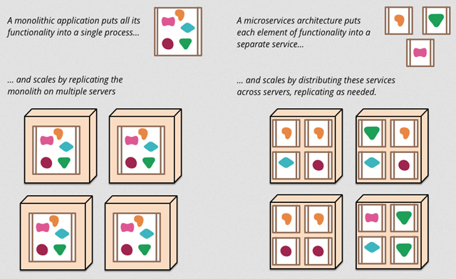

#微服务
[论文 Microservice.io]("Microservice.io")

[翻译 https://www.cnblogs.com/liuning8023/p/4493156.html]("https://www.cnblogs.com/liuning8023/p/4493156.html")

微服务架构风格：把单独的应用程序开发为一套小服务，每个小服务运行在自己的进程中，并使用轻量级通信机制。这些服务围绕业务来构建，并通过完全自动化机制来独立部署，服务可以使用不同的语言编写，使用不同的存储技术，并保持最低限度的集中式管理。

架构演变历程

#####单一应用架构
当网站流量很小时，只需一个应用，将所有功能都部署在一起，以减少部署节点和成本。此时，用于简化增删改查工作量的数据访问框架(ORM)是关键。

#####垂直应用架构
当访问量逐渐增大，单一应用增加机器带来的加速度越来越小，提升效率的方法之一是将应用拆成互不相干的几个应用，以提升效率。此时，用于加速前端页面开发的Web框架(MVC)是关键。

#####分布式服务架构
当垂直应用越来越多，应用之间交互不可避免，将核心业务抽取出来，作为独立的服务，逐渐形成稳定的服务中心，使前端应用能更快速的响应多变的市场需求。此时，用于提高业务复用及整合的分布式服务框架(RPC)是关键。

#####流动计算架构
当服务越来越多，容量的评估，小服务资源的浪费等问题逐渐显现，此时需增加一个调度中心基于访问压力实时管理集群容量，提高集群利用率。此时，用于提高机器利用率的资源调度和治理中心(SOA)是关键。

从整体架构到微服务架构最大的演变是通信方式的转变，从内部调用变成了远程调用，产生了大量的不可靠通信。因此需要把粗粒度的方法转为更为细粒度的通信。

单体架构的局限性

###组件化(Componentization)与服务(Service)
组件(component)是一个可独立替换和升级的单元
服务(service)是进程外组件(out-of-process component),服务之间利用某个机制通信，如webservice请求、rpc(remote-procedure-call)远程调用
组件和服务在很对面向对象语言中不是一个概念。
将应用程序按业务模块拆分为一个一个的服务，便于升级部署部分服务，但远程调用比进程内调用更消耗资源。

边界规范

小团队 2 pizza

###强化终端及弱化通道
微服务应用致力于松耦合、高内聚。采用单独的业务逻辑。

两种常被用到的协议：资源API的HTTP请求、响应和轻量级消息通信协议。

###分散治理

###分散数据管理
每个服务管理自己的数据库：无论是相同数据库的不同实例，还是不同的数据库系统。这种方法叫做Polyglot Persistence。

分散数据管理也就需要管理数据更新。通常使用事务来保证数据一致性，但耗时，分布式事务难以实施。微服务强调服务间事务的协调，并且一致性只能是最终一致性以及通过补偿运算处理问题。

###容错性设计
服务运行状态监控，以及出现故障的反应处理。

###同步是有害的
任何时候，在服务间的调用使用同步方法，都会遇到宕机时间的乘积效应。即系统的宕机时间是单个服务宕机时间的乘积。需要选择使用异步还是宕机处理，在www.guardian.co.uk中，它们在新平台中使用一种简单的规则来实现它：在Netflix中每次用户请求的同步调用，他们重新设计的平台API都会把它构建成异步的API来执行。

###微服务与SOA的区别
微服务剔除SOA中复杂的企业服务总线，所有的业务逻辑在服务内部处理，使用http(rest api)进行轻量化通讯。

SOA强调水平架构划分：前端、后端、数据库、测试等；微服务强调按垂直架构划分，按业务范围划分：每个服务完成一种特定业务功能，服务即产品。

SOA将组件以lib的方式和应用部署在同一个进程中运行；微服务各个服务独立运行。

传统应用倾向于使用统一的技术平台来解决所有问题，微服务针对不同业务特征选择不同的技术平台实现，去中心统一化，发挥各种技术优势。

SOA架构强调是异构系统之间的通信和解耦合，粗粒度，松耦合；微服务架构强调的是系统按业务边界做细粒度拆分和部署，解耦。
